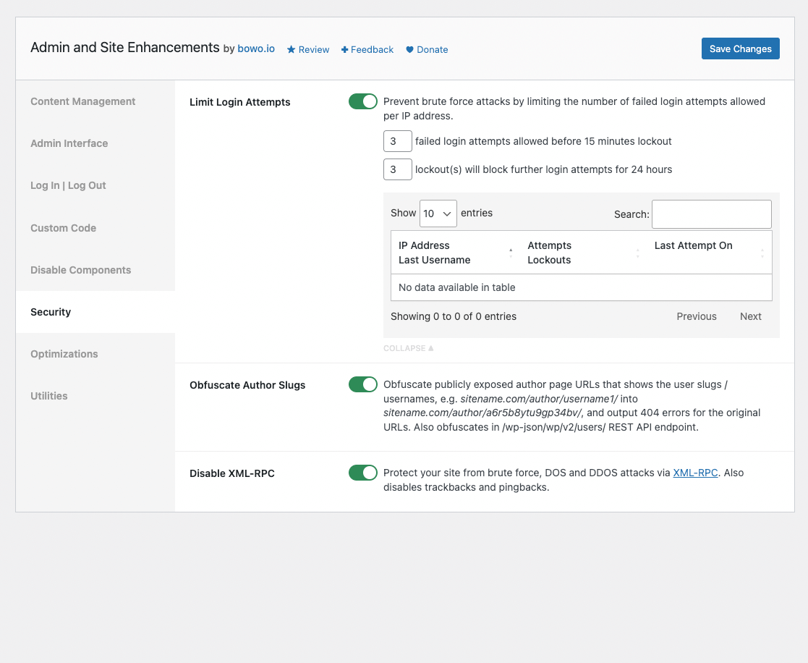
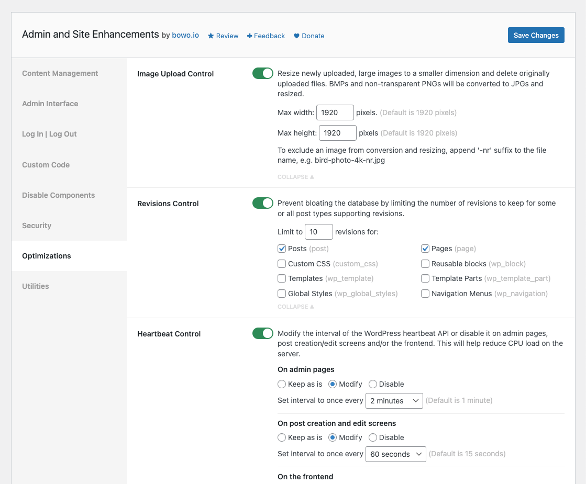
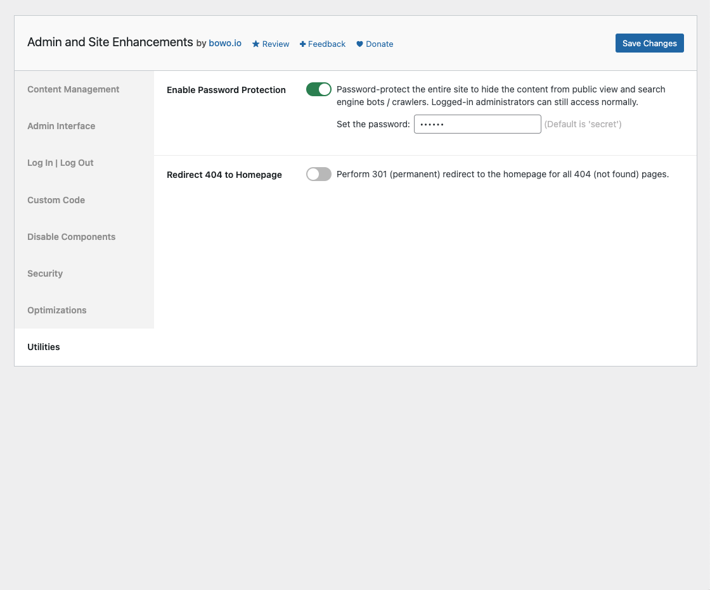

# Admin and Site Enhancements

Contributors: qriouslad  
Donate link: https://paypal.me/qriouslad  
Tags: enhancements, tweaks, optimizations, tools  
Requires at least: 4.6  
Tested up to: 6.1.1  
Stable tag: 4.2.0  
Requires PHP: 5.6  
License: GPLv2 or later  
License URI: http://www.gnu.org/licenses/gpl-2.0.html

Duplicate post, replace media, admin menu editor, custom css / code, disable gutenberg, heartbeat control and more in a single plugin.

## Description

Admin and Site Enhancements helps you to easily enhance various admin workflows and site aspects while replacing multiple plugins doing it. 

### Content Management

* **Enable Page and Post Duplication**. Enable one-click duplication of pages, posts and custom posts. The corresponding taxonomy terms and post meta will also be duplicated.
* **Enable Media Replacement**. Easily replace any type of media file with a new one while retaining the existing media ID, publish date and file name. So, no existing links will break.
* **Enable SVG Upload**. Allow some or all user roles to upload SVG files, which will then be sanitized to keep things secure.
* **Enable External Permalinks**. Enable pages, posts and/or custom post types to have permalinks that point to external URLs. Compatible with links added using [Page Links To](https://wordpress.org/plugins/page-links-to/).
* **Enable Revisions Control**. Prevent bloating the database by limiting the number of revisions to keep for some or all post types supporting revisions.
* **Enable Auto-Publishing of Posts with Missed Schedule**. Trigger publishing of scheduled posts of all types marked with "missed schedule", anytime the site is visited.
* **Enhance List Tables**. Improve the usefulness of listing pages of various post types by adding / removing columns and elements.
  * _Show the featured image column_: in the list tables for pages and post types that support featured images.
  * _Show the excerpt column_: in the list tables for pages and post types that support excerpt.
  * _Show the ID column_: in the list tables for pages, all post types, all taxonomies, media, users and comments.
  * _Remove the comments column_: in in the list tables for pages, post types that support comments, and alse media/attachments.
  * _Remove the post tags column_: in the list table for posts.
  * _Show custom taxonomy dropdown filter(s)_: on the list tables of all post types for taxonomies that are hierarchical like post categories.

### Admin Interface

* **Hide Admin Notices**. Clean up admin pages by moving notices into a separate panel easily accessible via the admin bar.
* **View Admin as Role**. View admin pages and the site (logged-in) as one of the non-administrator user roles.
* **Admin Menu Organizer**. Customize the order of the admin menu and optionally change menu item title or hide some items.
* **Disable Dashboard Widgets**. Clean up and speed up the dashboard by completely disabling some or all widgets. Disabled widgets won't load any assets nor show up under Screen Options.
* **Clean Up Admin Bar**. Remove various elements from the admin bar.
  * Remove WordPress logo/menu
  * Remove customize menu/link
  * Remove updates counter/link
  * Remove comments counter/link
  * Remove new content menu
  * Remove 'Howdy' text
* **Hide Admin Bar**. Hide it on the front end for all or some user roles.

### Log In / Log Out

* **Change Login URL**. Improve site security by using a custom login URL, e.g. www.example.com/backend
* **Enable Log In/Out Menu**. Enable log in, log out and dynamic log in/out menu item for addition to any menu.
* **Enable Last Login Column**. Log when users on the site last logged in and display the date and time in the users list table.
* **Redirect After Login / Logout**. Set custom redirect URL for all or some user roles after login / logout.

### Custom Code

* **Enable Custom Admin CSS**. Add custom CSS on all admin pages for all user roles.
* **Enable Custom Frontend CSS**. Add custom CSS on all frontend pages for all user roles.
* **Insert &lt;head&gt;, &lt;body&gt; and &lt;footer&gt; Code**. Easily insert &lt;meta&gt;, &lt;link&gt;, &lt;script&gt; and &lt;style&gt; tags, Google Analytics, Tag Manager, AdSense, Ads Conversion and Optimize code, Facebook, TikTok and Twitter pixels, etc.
* **Manage ads.txt and app-ads.txt**. Easily edit and validate your ads.txt and app-ads.txt content.
* **Manage robots.txt**. Easily edit and validate your robots.txt content.

### Disable Components

* **Disable Gutenberg**. Disable the Gutenberg block editor for some or all applicable post types. Optionally disable frontend block styles / CSS files for the selected post types.
* **Disable Comments**. Disable comments for some or all public post types. When disabled, existing comments will also be hidden on the frontend.
* **Disable REST API**. Disable REST API access for non-authenticated users and remove URL traces from &lt;head&gt;, HTTP headers and WP RSD endpoint.
* **Disable Feeds**. Disable all RSS, Atom and RDF feeds. This includes feeds for posts, categories, tags, comments, authors and search. Also removes traces of feed URLs from &lt;head&gt;.
* **Disable All Updates**. Completely disable core, theme and plugin updates and auto-updates. Will also disable update checks, notices and emails.

### Security

* **Limit Login Attempts**. Prevent brute force attacks by limiting the number of failed login attempts allowed per IP address.
* **Obfuscate Author Slugs**. Obfuscate publicly exposed author page URLs that shows the user slugs / usernames, e.g. _sitename.com/author/username1/_ into _sitename.com/author/a6r5b8ytu9gp34bv/_, and output 404 errors for the original URLs. Also obfuscates in _/wp-json/wp/v2/users/_ REST API endpoint.
* **Disable XML-RPC**. Protect your site from brute force, DOS and DDOS attacks via XML-RPC. Also disables trackbacks and pingbacks.

### Optimizations

* **Enable Heartbeat Control**. Modify the interval of the WordPress heartbeat API or disable it on admin pages, post creation/edit screens and/or the frontend. This will help reduce CPU load on the server.

### Utilities

* **Enable Password Protection**. Password-protect the entire site to hide the content from public view and search engine bots / crawlers. Logged-in administrators can still access normally.
* **Redirect 404 to Homepage**. Perform 301 (permanent) redirect to the homepage for all 404 (not found) pages.

Admin and Site Enhancements will include more enhancements, tweaks and useful features in future versions. Please [give feedback](https://wordpress.org/support/plugin/admin-site-enhancements/) on must-have plugins or code snippets you enable on sites that you manage, and the functionalities will be considered for inclusion as well.

### Give Back

* [A nice review](https://wordpress.org/plugins/admin-site-enhancements/#reviews) would be great!
* [Give feedback](https://wordpress.org/support/plugin/admin-site-enhancements/) and help improve future versions.
* [Github repo](https://github.com/qriouslad/admin-site-enhancements) to contribute code.
* [Donate](https://paypal.me/qriouslad) and support my work.

### Check These Out Too

* [System Dashboard](https://wordpress.org/plugins/system-dashboard/): Central dashboard to monitor various WordPress components, processes and data, including the server.
* [Debug Log Manager](https://wordpress.org/plugins/debug-log-manager/): Log PHP, database and JavaScript errors via WP_DEBUG with one click. Conveniently create, view, filter and clear the debug.log file.
* [Variable Inspector](https://wordpress.org/plugins/variable-inspector/): Inspect PHP variables on a central dashboard in wp-admin for convenient debugging.
* [Code Explorer](https://wordpress.org/plugins/code-explorer/): Fast directory explorer and file/code viewer with syntax highlighting.
* [Flexible Scroll Top](https://wordpress.org/plugins/flexible-scroll-top/) and [Floating Share Buttons](https://wordpress.org/plugins/floating-share-button/) is a lightweight combo with minimalist UI.

## Screenshots

1. Content Management
   
2. Admin Interface
   
3. Log In | Log Out
   
4. Custom Code
   
5. Disable Components
   
6. Security
   
7. Optimizations
   
8. Utilities
   

## Frequently Asked Questions

### Why build this plugin?

Hoping that this is useful in reducing the number of plugins we install the first time we set up a site.

## Changelog

### 4.2.0 (2023.01.23)

* **[ADDED] Admin Interface >> Disable Dashboard Widgets**. Clean up and speed up the dashboard by completely disabling some or all widgets. Disabled widgets won't load any assets nor show up under Screen Options.

### 4.1.0 (2023.01.16)

* **[ADDED] Utilities >> Enable Password Protection**. Password-protect the entire site to hide the content from public view and search engine bots / crawlers. Logged-in administrators can still access normally.

### 4.0.1 (2023.01.12)

* **[FIXED] Content Management >> Enable SVG Upload**: Fixed a bug where uploaded, non-SVG media files does not have metadata generated when Enable SVG Upload is enabled.

### 4.0.0 (2023.01.04)

* **[ADDED] Disable Components >> Disable All Updates**. Completely disable core, theme and plugin updates and auto-updates. Will also disable update checks, notices and emails.

### 3.9.2 (2023.01.03)

* **[FIXED] Custom Code >> Manage robots.txt**. Fixed ["Undefined variable" issue](https://wordpress.org/support/topic/undefine-variable-field_option_value/) reported by [kwbrayton](https://profiles.wordpress.org/kwbrayton/). Also make this feature work on scenarios where an actual robots.txt file exists, not just the virtual one created by default, by WordPress. In such case, the robots.txt file will be renamed to robots_txt_backup_{timestamp}.txt when this feature is enabled. Vice versa, when the feature is disabled, the backup file will be renamed back to robots.txt, so it will be in use again as it were.

### 3.9.1 (2022.12.29)

* **[FIXED] Content Management >> Enable External Permalinks**. Fixed an issue where default WordPress permalink for a post loads white, empty screen when no external permalink has been set for the post.

### 3.9.0 (2022.12.29)

* **[ADDED] Content Management >> Enable External Permalinks**. Enable pages, posts and/or custom post types to have permalinks that point to external URLs. Compatible with links added using [Page Links To](https://wordpress.org/plugins/page-links-to/).

### 3.8.0 (2022.12.27)

* **[ADDED] Optimizations >> Enable Heartbeat Control**. Modify the interval of the WordPress heartbeat API or disable it on admin pages, post creation/edit screens and/or the frontend. This will help reduce CPU load on the server.

### 3.7.0 (2022.12.25)

* **[ADDED] Content Management >> Enable Revisions Control**. Prevent bloating the database by limiting the number of revisions to keep for some or all post types supporting revisions.

### 3.6.1 (2022.12.22)

* **[CHANGED] Custom Code >> Manage robots.txt**. Fixed an issue where code editor was not rendered properly upon clicking the Custom Code tab.

### 3.6.0 (2022.12.22)

* **[CHANGED] Added "Log In | Log Out" and "Custom Code" categories**. Recategorizes relevant features under these new categories.
* **[ADDED] Log In | Log Out >> Enable Last Login Column**. Log when users on the site last logged in and display the date and time in the users list table.

### 3.5.0 (2022.12.19)

* **[ADDED] Utilities >> Manage robots.txt**. Easily edit and validate your robots.txt content.

### 3.4.0 (2022.12.16)

* **[ADDED] Utilities >> Enable Log In/Out Menu**. Enable log in, log out and dynamic log in/out menu item for addition to any menu. Depending on the user's logged-in status, the menu item will show up, disappear or change.

### 3.3.0 (2022.12.12)

* **[ADDED] Utilities >> Insert &lt;head&gt;, &lt;body&gt; and &lt;footer&gt; Code**. Easily insert &lt;meta&gt;, &lt;link&gt;, &lt;script&gt; and &lt;style&gt; tags, Google Analytics, Tag Manager, AdSense, Ads Conversion and Optimize code, Facebook, TikTok and Twitter pixels, etc.
* **[CHANGED] Utilities >> Manage ads.txt and app-ads.txt** is now a single settings field.

### 3.2.0 (2022.12.12)

* **[ADDED] Utilities >> Manage ads.txt and app-ads.txt**: Easily edit and validate your ads.txt and app-ads.txt content. Please backup existing ads.txt and app-ads.txt content and remove those files before copying the original content into the ads.txt and app-ads.txt manager in the Utilities tab. If no ads.txt / app-ads.txt files exist in the root directory of your WordPress installation, you can immediately add content for both files.

### 3.1.0 (2022.12.11)

* **[ADDED] Content Management >> Enable Auto-Publishing of Posts with Missed Schedule**: Trigger publishing of scheduled posts of all types marked with "missed schedule", anytime the site is visited. Uses Transients API to reduce load to the DB on busy sites. Will only query the DB once every 15 minutes (at most).

### 3.0.6 (2022.12.08)

* **[CHANGED] Admin Interface >> Admin Menu Organizer**: Enqueue jQuery UI widget.min.js for WP version less than 5.6.0. This ensures the feature works for those WP versions.

### 3.0.5 (2022.12.08)

* **[CHANGED] Admin Interface >> Admin Menu Organizer**: Enqueue the minified version of jQuery UI scripts, as older versions of WP do not have the unminified version.

### 3.0.4 (2022.12.07)

* **[CHANGED] Admin Interface >> Admin Menu Organizer**: Substantially lower priorities of actions that handles rendering of custom menu order, custom menu title and hiding of menu items. This is so that menu items added late by active plugins and theme are handled properly.

### 3.0.3 (2022.12.07)

* **[CHANGED] Admin Interface >> Admin Menu Organizer**: Make sure menu item sortables reflect custom menu order saved in options, especially when this feature is re-enabled. Remove all HTMl tags and content inside them from menu item titles in the sortables.

### 3.0.2 (2022.12.07)

* **[CHANGED] Hide stubborn notices** appearing inside the admin page header (via CSS).

### 3.0.1 (2022.12.01)

* **[CHANGED] Admin Interface >> Admin Menu Organizer**: Make sure newer menu items added by newly installed plugins or activated theme are showing up towards the end of the admin menu and the menu item sortables. Comments and updates counters are now hidden. Sortables for menu separators have been faded out to make actual menu items stand out more.
* **[CHANGED] Disable Components >> Disable Comments**: Ensure trackbacks metabox is also hidden on edit screens of post types where commenting is disabled.

### 3.0.0 (2022.11.30)

* **[ADDED] Disable Components >> Disable Feeds**: Disable all RSS, Atom and RDF feeds. This includes feeds for posts, categories, tags, comments, authors and search. Also removes traces of feed URLs from &lt;head&gt;.

### 2.9.0 (2022.11.30)

* **[ADDED] Disable Components >> Disable REST API**: Disable REST API access for non-authenticated users and remove URL traces from \<head\>, HTTP headers and WP RSD endpoint.

### 2.8.3 (2022.11.29)

* **[CHANGED] Admin Interface >> Admin Menu Organizer**: Fix for missing Show All toggle in certain scenarios.

### 2.8.2 (2022.11.29)

* **[CHANGED] Admin Interface >> Admin Menu Organizer**: Allow customizing menu item title, for menu items added by plugins or the active theme, i.e. not from WordPress core.

### 2.8.1 (2022.11.28)

* **[CHANGED] Admin Interface >> Admin Menu Organizer**: Fixed the issue when menu items are no longer shown upon saving. This happened when Admin Menu Organizer was enabled and directly saved without making any changes to the menu order first. 

### 2.8.0 (2022.11.28)

* **[ADDED] Disable Components >> Disable Gutenberg**: Disable the Gutenberg block editor for some or all applicable post types. Optionally disable frontend block styles / CSS files for the selected post types.

### 2.7.0 (2022.11.27)

* **[ADDED] Disable Components >> Disable Comments**: Disable comments for some or all public post types. When disabled, existing comments will also be hidden on the frontend.
* **[CHANGED] Security >> Limit Login Attempts**: Improved styling of empty datatable, i.e. when there is no failed login attempts logged.
* **[CHANGED] Settings tab position** is now saved to browser cookie, so it persists upon saving changes or revisiting it from elsewhere in wp-admin.
* **[CHANGED] Some code refactoring** to make logical separation and categorization of features clearer. CodeMirror and DataTables assets loading are also moved

### 2.6.0 (2022.11.19)

* **[ADDED] Content Management >> Enable SVG Upload**: Allow some or all user roles to upload SVG files, which will then be sanitized to keep things secure.

### 2.5.0 (2022.11.18)

* **[ADDED] Security >> Limit Login Attempts**: Prevent brute force attacks by limiting the number of failed login attempts allowed per IP address.
* **[CHANGED] Security >> Custom Login URL** feature has been made compatible with Limit Login Attempts feature.
* **[CHANGED] Security >> Change Login URL** now works with the interim login modal window, the one that pops up when user is logged out in the background.
* **[CHANGED] Security >> Change Login URL** adds another process to ensure user is redirected to the dashboard after successful login. It was redirecting to the /not_found/ (404) page in rare occasions as [reported by @vdrover](https://wordpress.org/support/topic/change-login-url-redirects-to-not-found/).
* **[CHANGED] Utilities >> Redirect After Login** will correctly override default login redirection by Change Login URL.
* **[CHANGED] Improve code comments throughout**.

### 2.4.0 (2022.11.10)

* **[ADDED] Utilities >> Enable Custom Frontend CSS**: Add custom CSS on all frontend pages for all user roles.

### 2.3.0 (2022.11.09)

* **[ADDED] Utilities >> Enable Custom Admin CSS**: Add custom CSS on all admin pages for all user roles.

### 2.2.0 (2022.11.09)

* **[ADDED] Security >> Disable XML-RPC**: Protect your site from brute force, DOS and DDOS attacks via XML-RPC. Also disables trackbacks and pingbacks.
* **[ADDED] Expand/collapse toggle** for feature settings that takes up longer vertical space, e.g. Admin Menu Customizer.
* **[CHANGED] Refactor code around plugin settings page**. Now uses separate classes for sections and fields registration, for sanitization of field values and for rendering the fields on the admin page.

### 2.1.0 (2022.11.08)

* **[ADDED] Security >> Obfuscate Author Slugs**: Obfuscate publicly exposed author page URLs that shows the user slugs / usernames, e.g. _sitename.com/author/username1/_ into _sitename.com/author/a6r5b8ytu9gp34bv/_, and output 404 errors for the original URLs. Also obfuscates in _/wp-json/wp/v2/users/_ REST API endpoint. Props to [pull request](https://github.com/qriouslad/admin-site-enhancements/pull/1) from [Wahyu Arief @wahyuief](https://github.com/wahyuief) and [functions](https://plugins.trac.wordpress.org/browser/smart-user-slug-hider/tags/4.0.2/inc/class-smart-user-slug-hider.php) from [Smart User Slug Hider
](https://wordpress.org/plugins/smart-user-slug-hider/).

### 2.0.0 (2022.11.06)

* **[ADDED] Admin Interface >> Admin Menu Organizer**: Customize the order of the admin menu and optionally hide some items.

### 1.9.0 (2022.11.03)

* **[ADDED] Admin Interface >> Hide or Modify Elements**: Easily simplify or customize various admin UI elements, starting with the admin bar.
* **[CHANGED] Content Management >> Enhance List Tables**: this combines previously separate features related to list tables for various post types.

### 1.8.0 (2022.11.03)

* **[ADDED] Admin Interface >> View Admin as Role**: View admin pages and the site (logged-in) as one of the non-administrator user roles.

### 1.7.0 (2022.10.31)

* **[ADDED] Utilities >> Redirect 404 to Homepage**: Perform 301 (permanent) redirect to the homepage for all 404 (not found) pages.

### 1.6.0 (2022.10.31)

* **[ADDED] Utilities >> Redirect After Logout**: Set custom redirect URL for all or some user roles after logout.

### 1.5.0 (2022.10.30)

* **[ADDED] Utilities >> Redirect After Login**: Set custom redirect URL for all or some user roles after login.

### 1.4.0 (2022.10.30)

* **[ADDED] Security >> Change Login URL**: allow for setting a custom login URL to improve site security.

### 1.3.0 (2022.10.29)

* **[ADDED] Admin Interface >> Hide Admin Bar**: Hide it on the front end for all or some user roles.

### 1.2.0 (2022.10.28)

* **[ADDED] Admin Interface >> Hide Admin Notices**: Clean up admin pages by moving notices into a separate panel easily accessible via the admin bar.

### 1.1.0 (2022.10.22)

* **[ADDED] Content Management >> Enable Media Replacement**: Enable easy replacement of any type of media file with a new one while retaining the existing media ID and file name.

### 1.0.0 (2022.10.17)

* Initial stable release. 