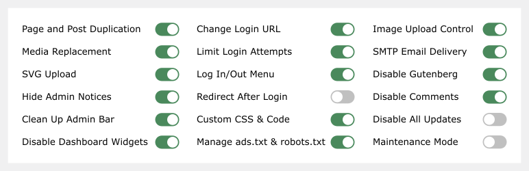
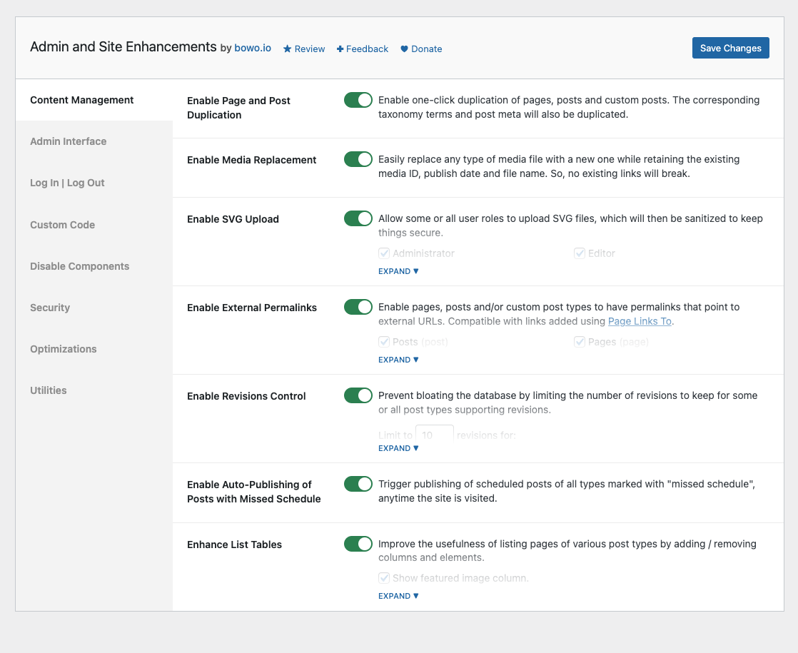
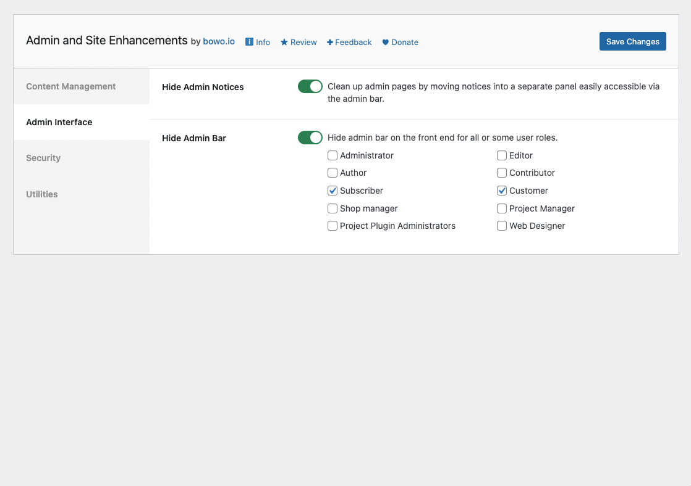
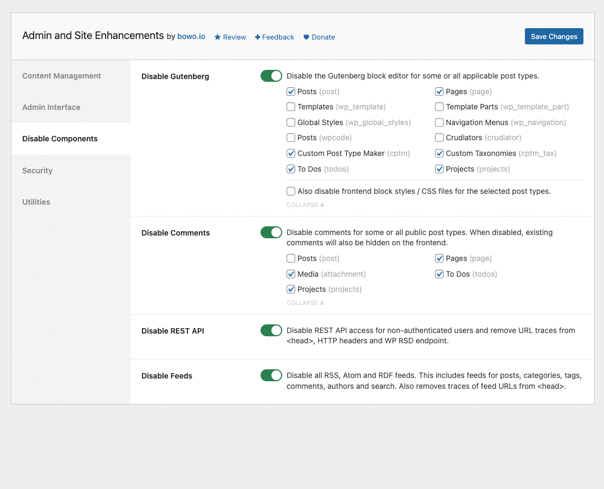
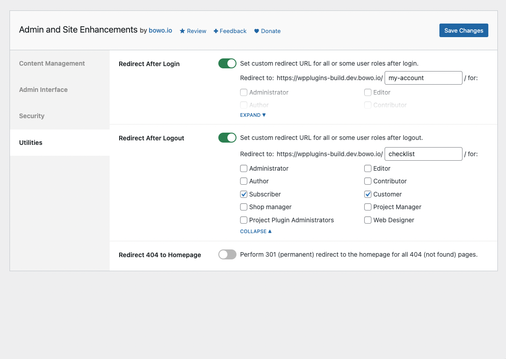
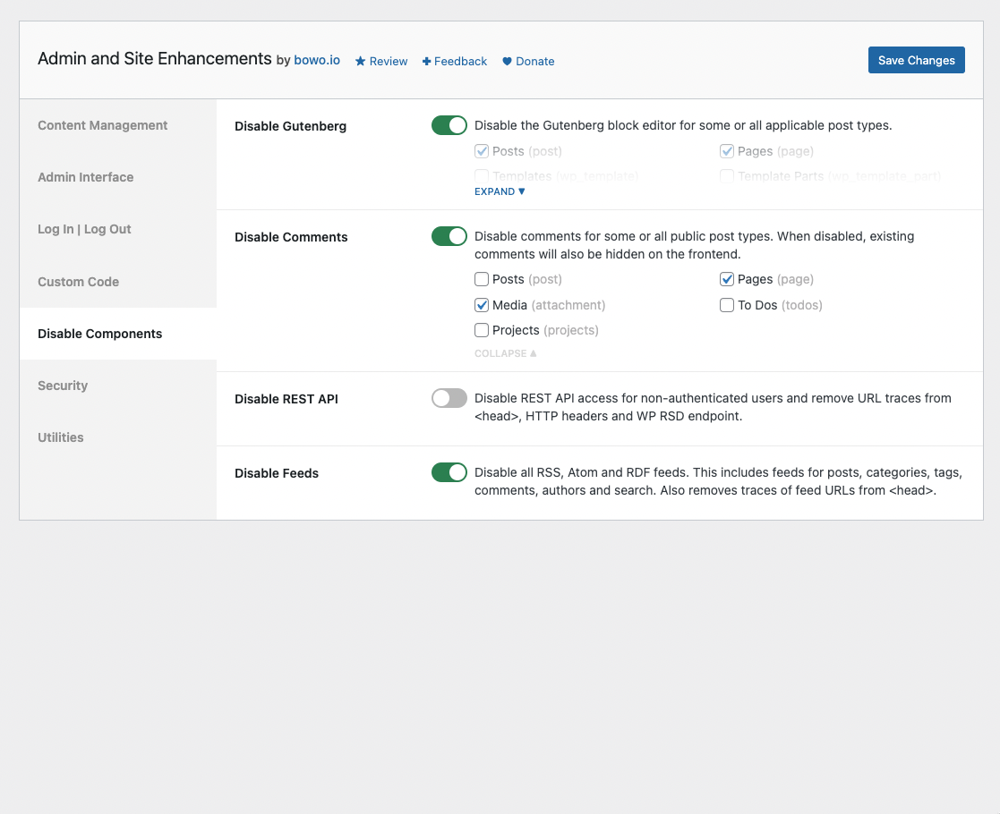

# Admin and Site Enhancements

Contributors: qriouslad  
Donate link: https://paypal.me/qriouslad  
Tags: enhancements, tweaks, optimizations, tools  
Requires at least: 4.6  
Tested up to: 6.1  
Stable tag: 2.7.0  
Requires PHP: 5.6  
License: GPLv2 or later  
License URI: http://www.gnu.org/licenses/gpl-2.0.html

Duplicate page / post, replace media, hide login, hide admin notices, hide admin bar, login / logout / 404 redirect, and more in a single plugin.

## Description

Admin and Site Enhancements helps you to easily enhance various admin workflows and site aspects while replacing multiple plugins doing it. 

### Content Management

* **Enable Page and Post Duplication**. Enable one-click duplication of pages, posts and custom posts. The corresponding taxonomy terms and post meta will also be duplicated.
* **Enable Media Replacement**. Easily replace any type of media file with a new one while retaining the existing media ID, publish date and file name. So, no existing links will break.
* **Enable SVG Upload**. Allow some or all user roles to upload SVG files, which will then be sanitized to keep things secure.
* **Enhance List Tables**. Improve the usefulness of listing pages of various post types by adding / removing columns and elements.
  * _Show the featured image column_: in the list tables for pages and post types that support featured images.
  * _Show the excerpt column_: in the list tables for pages and post types that support excerpt.
  * _Show the ID column_: in the list tables for pages, all post types, all taxonomies, media, users and comments.
  * _Remove the comments column_: in in the list tables for pages, post types that support comments, and alse media/attachments.
  * _Remove the post tags column_: in the list table for posts.
  * _Show custom taxonomy dropdown filter(s)_: on the list tables of all post types for taxonomies that are hierarchical like post categories.

### Admin Interface

* **Hide Admin Notices**. Clean up admin pages by moving notices into a separate panel easily accessible via the admin bar.
* **View Admin as Role**. View admin pages and the site (logged-in) as one of the non-administrator user roles.
* **Admin Menu Organizer**. Customize the order of the admin menu and optionally hide some items.
* **Clean Up Admin Bar**. Remove various elements from the admin bar.
  * Remove WordPress logo/menu
  * Remove customize menu/link
  * Remove updates counter/link
  * Remove comments counter/link
  * Remove new content menu
  * Remove 'Howdy' text
* **Hide Admin Bar**. Hide it on the front end for all or some user roles.

### Disable Components

* **Disable Comments**. Disable comments for some or all public post types. When disabled, existing comments will also be hidden on the frontend.

### Security

* **Change Login URL**. Improve site security by using a custom login URL, e.g. www.example.com/backend
* **Limit Login Attempts**. Prevent brute force attacks by limiting the number of failed login attempts allowed per IP address.
* **Obfuscate Author Slugs**. Obfuscate publicly exposed author page URLs that shows the user slugs / usernames, e.g. _sitename.com/author/username1/_ into _sitename.com/author/a6r5b8ytu9gp34bv/_, and output 404 errors for the original URLs. Also obfuscates in _/wp-json/wp/v2/users/_ REST API endpoint.
* **Disable XML-RPC**. Protect your site from brute force, DOS and DDOS attacks via XML-RPC. Also disables trackbacks and pingbacks.

### Utilities

* **Enable Custom Admin CSS**. Add custom CSS on all admin pages for all user roles.
* **Enable Custom Frontend CSS**. Add custom CSS on all frontend pages for all user roles.
* **Redirect After Login / Logout**. Set custom redirect URL for all or some user roles after login / logout.
* **Redirect 404 to Homepage**. Perform 301 (permanent) redirect to the homepage for all 404 (not found) pages.

Admin and Site Enhancements will include more enhancements, tweaks and useful features in future versions. Please [give feedback](https://wordpress.org/support/plugin/admin-site-enhancements/) on must-have plugins or code snippets you enable on sites that you manage, and the functionalities will be considered for inclusion as well.

### Give Back

* [A nice review](https://wordpress.org/plugins/admin-site-enhancements/#reviews) would be great!
* [Give feedback](https://wordpress.org/support/plugin/admin-site-enhancements/) and help improve future versions.
* [Github repo](https://github.com/qriouslad/admin-site-enhancements) to contribute code.
* [Donate](https://paypal.me/qriouslad) and support my work.

### Check These Out Too

* [System Dashboard](https://wordpress.org/plugins/system-dashboard/): Central dashboard to monitor various WordPress components, processes and data, including the server.
* [Debug Log Manager](https://wordpress.org/plugins/debug-log-manager/): Log PHP, database and JavaScript errors via WP_DEBUG with one click. Conveniently create, view, filter and clear the debug.log file.
* [Variable Inspector](https://wordpress.org/plugins/variable-inspector/): Inspect PHP variables on a central dashboard in wp-admin for convenient debugging.
* [Code Explorer](https://wordpress.org/plugins/code-explorer/): Fast directory explorer and file/code viewer with syntax highlighting.

## Screenshots

1. Content Management
   
2. Admin Interface
   
3. Disable Components
   
4. Security
   
5. Utilities
   

## Frequently Asked Questions

### Why build this plugin?

Hoping that this is useful in reducing the number of plugins we install the first time we set up a site.

## Changelog

### 2.7.0 (2022.11.27)

* **[ADDED] Disable Components >> Disable Comments**: Disable comments for some or all public post types. When disabled, existing comments will also be hidden on the frontend.
* **[CHANGED] Security >> Limit Login Attempts**: Improved styling of empty datatable, i.e. when there is no failed login attempts logged.
* **[CHANGED] Settings tab position** is now saved to browser cookie, so it persists upon saving changes or revisiting it from elsewhere in wp-admin.
* **[CHANGED] Some code refactoring** to make logical separation and categorization of features clearer. CodeMirror and DataTables assets loading are also moved

### 2.6.0 (2022.11.19)

* **[ADDED] Content Management >> Enable SVG Upload**: Allow some or all user roles to upload SVG files, which will then be sanitized to keep things secure.

### 2.5.0 (2022.11.18)

* **[ADDED] Security >> Limit Login Attempts**: Prevent brute force attacks by limiting the number of failed login attempts allowed per IP address.
* **[CHANGED] Security >> Custom Login URL** feature has been made compatible with Limit Login Attempts feature.
* **[CHANGED] Security >> Change Login URL** now works with the interim login modal window, the one that pops up when user is logged out in the background.
* **[CHANGED] Security >> Change Login URL** adds another process to ensure user is redirected to the dashboard after successful login. It was redirecting to the /not_found/ (404) page in rare occasions as [reported by @vdrover](https://wordpress.org/support/topic/change-login-url-redirects-to-not-found/).
* **[CHANGED] Utilities >> Redirect After Login** will correctly override default login redirection by Change Login URL.
* **[CHANGED] Improve code comments throughout**.

### 2.4.0 (2022.11.10)

* **[ADDED] Utilities >> Enable Custom Frontend CSS**: Add custom CSS on all frontend pages for all user roles.

### 2.3.0 (2022.11.09)

* **[ADDED] Utilities >> Enable Custom Admin CSS**: Add custom CSS on all admin pages for all user roles.

### 2.2.0 (2022.11.09)

* **[ADDED] Security >> Disable XML-RPC**: Protect your site from brute force, DOS and DDOS attacks via XML-RPC. Also disables trackbacks and pingbacks.
* **[ADDED] Expand/collapse toggle** for feature settings that takes up longer vertical space, e.g. Admin Menu Customizer.
* **[CHANGED] Refactor code around plugin settings page**. Now uses separate classes for sections and fields registration, for sanitization of field values and for rendering the fields on the admin page.

### 2.1.0 (2022.11.08)

* **[ADDED] Security >> Obfuscate Author Slugs**: Obfuscate publicly exposed author page URLs that shows the user slugs / usernames, e.g. _sitename.com/author/username1/_ into _sitename.com/author/a6r5b8ytu9gp34bv/_, and output 404 errors for the original URLs. Also obfuscates in _/wp-json/wp/v2/users/_ REST API endpoint. Props to [pull request](https://github.com/qriouslad/admin-site-enhancements/pull/1) from [Wahyu Arief @wahyuief](https://github.com/wahyuief) and [functions](https://plugins.trac.wordpress.org/browser/smart-user-slug-hider/tags/4.0.2/inc/class-smart-user-slug-hider.php) from [Smart User Slug Hider
](https://wordpress.org/plugins/smart-user-slug-hider/).

### 2.0.0 (2022.11.06)

* **[ADDED] Admin Interface >> Admin Menu Organizer**: Customize the order of the admin menu and optionally hide some items.

### 1.9.0 (2022.11.03)

* **[ADDED] Admin Interface >> Hide or Modify Elements**: Easily simplify or customize various admin UI elements, starting with the admin bar.
* **[CHANGED] Content Management >> Enhance List Tables**: this combines previously separate features related to list tables for various post types.

### 1.8.0 (2022.11.03)

* **[ADDED] Admin Interface >> View Admin as Role**: View admin pages and the site (logged-in) as one of the non-administrator user roles.

### 1.7.0 (2022.10.31)

* **[ADDED] Utilities >> Redirect 404 to Homepage**: Perform 301 (permanent) redirect to the homepage for all 404 (not found) pages.

### 1.6.0 (2022.10.31)

* **[ADDED] Utilities >> Redirect After Logout**: Set custom redirect URL for all or some user roles after logout.

### 1.5.0 (2022.10.30)

* **[ADDED] Utilities >> Redirect After Login**: Set custom redirect URL for all or some user roles after login.

### 1.4.0 (2022.10.30)

* **[ADDED] Security >> Change Login URL**: allow for setting a custom login URL to improve site security.

### 1.3.0 (2022.10.29)

* **[ADDED] Admin Interface >> Hide Admin Bar**: Hide it on the front end for all or some user roles.

### 1.2.0 (2022.10.28)

* **[ADDED] Admin Interface >> Hide Admin Notices**: Clean up admin pages by moving notices into a separate panel easily accessible via the admin bar.

### 1.1.0 (2022.10.22)

* **[ADDED] Content Management >> Enable Media Replacement**: Enable easy replacement of any type of media file with a new one while retaining the existing media ID and file name.

### 1.0.0 (2022.10.17)

* Initial stable release. 